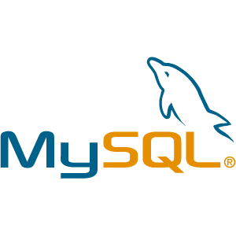
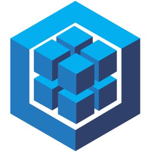
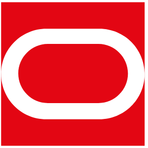
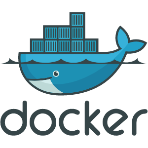
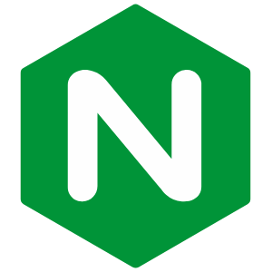

### Hi there! 

I'm [Yeasir `[ya·sir]`](https://www.yeasirhugais.com). I'm a freelance Web Developer based out of California. In my spare time, I like to challenge myself to learn new things, _(normally, I spend about 1-3 hours before or after work building & learning new ways to write efficient algorithms)_. Most of my projects below 👇🏻 are focused on two things -  **to help me become a better software developer** & **share my newfound knowledge with the dev community** 📚. Feel free to explore my repo & use any of my public projects to learn more about _algorithms in JavaScript_.

```javascript
const greet = 'Hello ';

console.log(greet + "World")
//output: Hello World
```

### Web Technologies & Tools
---
[](https://code.visualstudio.com/)
[](https://git-scm.com/)
[](https://github.com/yeasir01)
[](https://getbootstrap.com/)
[](https://www.ecma-international.org/)
[](https://github.com/yeasir01)
[](https://sass-lang.com/)
[](https://jquery.com/)
[](https://reactjs.org/)
[](https://nodejs.org/)
[](https://www.npmjs.com/)
[](https://handlebarsjs.com/)
[](https://jestjs.io/)
[](https://www.mysql.com/)
[](https://www.mongodb.com/)
[](https://sequelize.org/)
[](https://www.oracle.com/cloud/)
[](https://www.docker.com/)
[](https://aws.amazon.com/ec2/)
[](https://www.cloudflare.com/)
[](https://linuxfoundation.org/)
[](https://github.com/yeasir01)
[](https://www.nginx.com/)
[](https://www.postman.com/)


[](https://github.com/yeasir01)
